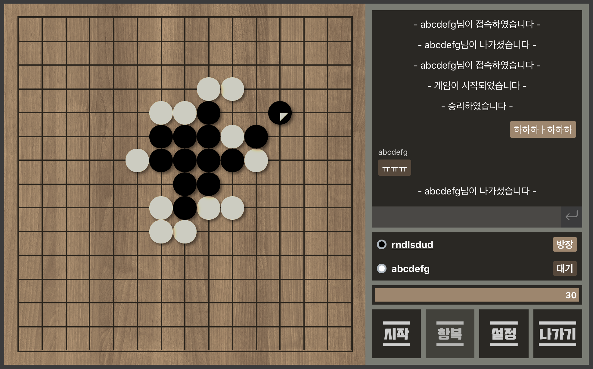
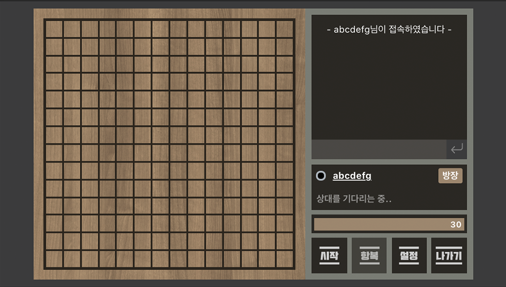
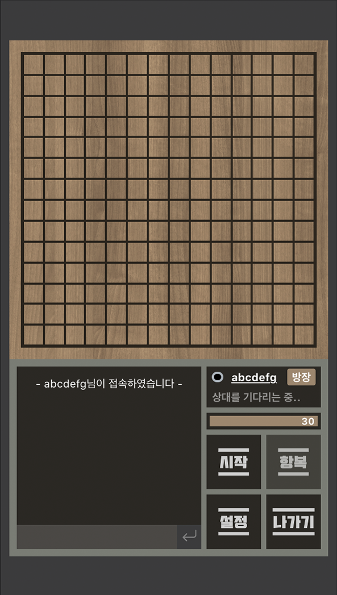
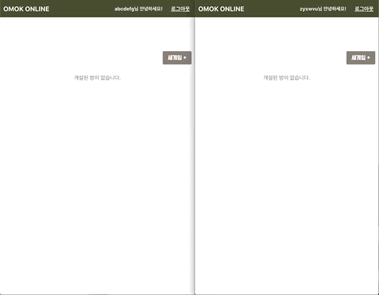
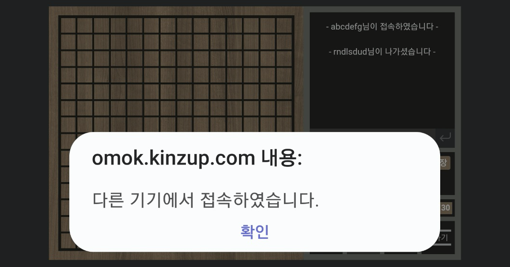
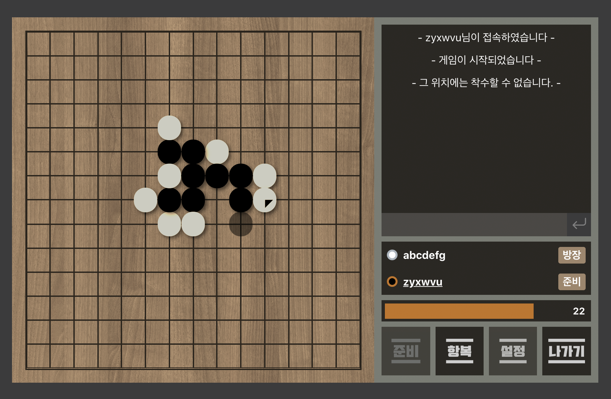

# TOY PROJECT - 오목 온라인 (클라이언트)

2인 멀티플레이가 가능한 오목 게임 웹 어플리케이션입니다.
<br>
직접 방을 생성하거나 다른 사람이 생성한 방에 들어가서 상대방과 대전할 수 있습니다.
<br>

- [오목 온라인 Live Page](http://omok.kinzup.com)
  <br>
- [Repository for Server Code](https://github.com/KINZ-UP/omok_server)

<br>

_Fig. 1 Screenshot_
<br>

<br>
<br>

## Teck Stacks

| FRONTEND                                             | BACKEND                          | DEPLOYMENT                        |
| :--------------------------------------------------- | :------------------------------- | :-------------------------------- |
| React<br>Redux<br>Redux-saga<br>Socket.io-client<br> | Express<br>socket.io<br>mongoose | AWS S3<br>AWS Route 53<br>AWS EC2 |

<br>

## How to Use

회원가입 / 로그인 후 게임 로비에서 **새게임** 버튼을 클릭하여 방을 만들거나 다른 사람이 만들 방에 접속하여 플레이합니다.
<br>
방 생성시 공개/비공개 여부를 설정할 수 있으며, 게임 제한시간 및 오목판의 한변의 칸수를 설정할 수 있습니다.
<br>
모든 플레이어가 준비를 마치면 게임을 시작할 수 있으며 일반적인 오목 룰에 따라 한 턴 씩 돌아가면서 게임을 진행합니다.
게임방 내에서 상대와 실시간 채팅이 가능합니다.

<br>

## Game Rules

- 일반적인 오목룰에 따라 흑과 백이 돌아가면서 빈 칸에 돌을 놓습니다.
- 어느 한 색깔의 돌이 연이어 5개 놓이는 _오목_ 상태가 되면 해당 플레이어가 승리합니다.
- 렌주룰을 적용하여 흑은 쌍삼 자리에 착수할 수 없으며, 육목 이상의 경우 승리 조건(오목)으로 인정하지 않습니다.
- 백은 돌이 놓이지 않은 모든 곳에 제약없이 착수할 수 있으며, 육목 이상의 모양도 승리 조건을 만족한 것으로 인정합니다.
- 제한 시간 안에 돌을 놓지 않으면 시간패합니다.

<br>

## Key Features

### Fully Responsive Layout

_Device의 aspect-ratio에 따라 수평 / 수직 배치_
|Horizontal|Vertical|
|:--:|:--:|
|||

### Auto Renewing of Game List

_게임이 생성되거나 게임 정보가 갱신되었을 때 리스트를 자동으로 업데이트_<br><br>


### Handling User Disconnection

_게임 중 플레이어의 연결이 끊긴 경우 30초간 대기하였다가 퇴장 처리_<br>
_30초 이내에 재접속시 정상 진행_<br><br>

### Handling Connection From Other Gadget With Same Account

_동일 계정으로 다른 기기에서 접속시 기 접속 중인 기기에서는 방에서 퇴장 처리_<br><br>


<br>
<br>

### 금수 알고리즘 적용

_렌주룰을 적용하여 흑에게 쌍삼 자리에 금수 적용_

<br>

착수하였을 때 삼목과 한 칸 떨어진 삼목 등 상대방이 수비를 하지 않고 한 수를 더 두었을 경우 양쪽이 모두 막혀있지 않은 사목이 되는 모양이 두 곳 이상일 때를 쌍삼으로 정의하고, 해당 정의에 입각하여 쌍삼 알고리즘을 구현

<br>
<br>

## How to Install

### Clone Repository

```bash
git clone
```

### Install Packages

```js
npm i

// or if using yarn

yarn
```

### Add Environmental Variables

_.dev_

```
REACT_APP_BASE_URL=INSERT_SERVER_URL_HERE
```

root 폴더에 _.dev_ 를 생성하여 **REACT_APP_BASE_URL** 변수에 서버 URL을 입력합니다.
<br>

[서버 Repository](https://github.com/KINZ-UP/omok_server)

### Execute

```js
npm start

// or

yarn start
```
